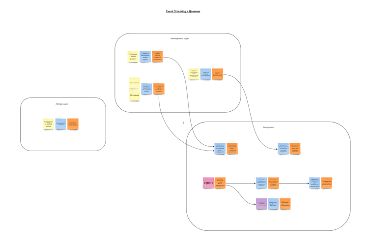
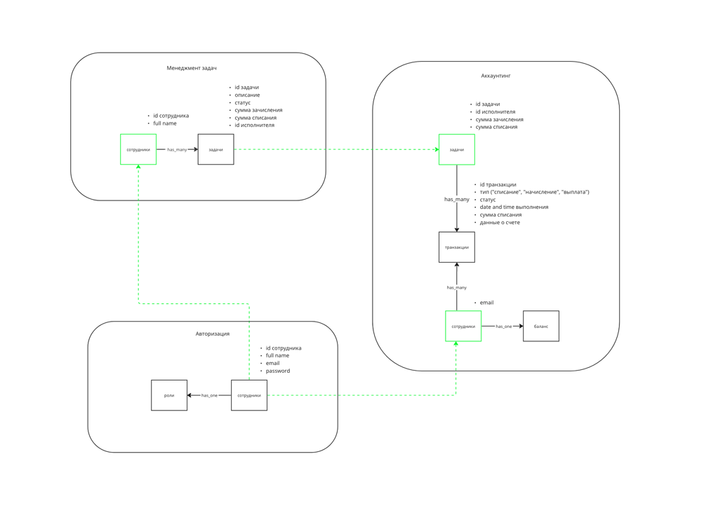
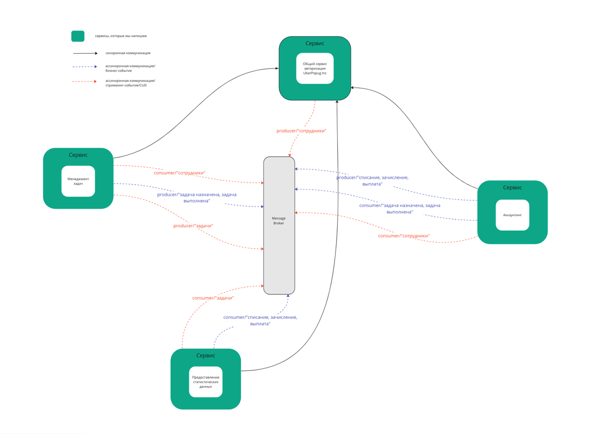

# Awesome Task Exchange System (aTES) для UberPopug Inc

Ccылка на Miro, где можно более близко посмотреть схемы: https://miro.com/app/board/uXjVMxKZuqE=/?share_link_id=3964863916

## Event Storming + Домены

## Модель данных

## Разбивка доменов на сервисы

### Domain -> Service подход

#### 1. Домен "Менеджмент задач" -> Сервис "Менеджмент задач"

**Чем занимается:**

- CRUD по задачам
- позволяет назначить на задачу исполнителя
- автоматически (по формулам) рассчитывает суммы списания/начисления при создании
- позволяет переназначать открытые задачи на других исполнителей
- позволяет пометить задачу как выполненную
- отправляет стримминг событие с параметрами задачи в случае изменения ее параметров
- получает сотрудников асинхронно, обновляет и хранит у себя список "доступных для назначения" сотрудников (с ролью, отличной то адмнистратора и менеджера)
- отправляет бизнес события при назначении задачи и при выполнении задачи

**БД:**
- реляционная с поддержкой ACID, например PostgreSQL

#### 2. Домен "Авторизация" -> Сервис "SSO"

**Чем занимается:**

- аутентификация/авторизация/генерация токенов для использования в API других сервисов/рефреш токенов
- CRUD сотрудников, в т.ч. смена ролей
- асинхронно отправляет CUD событие с информацией о сотрудниках при создании/удалении или изменении параметров, отражаемых в событии

**БД:**
- реляционная с поддержкой ACID, например PostgreSQL

### Domain -> Services подход

#### 1. Домен "Аккаунтинг" -> Сервис "Аккаунтинг" + Сервис "Статистика и аналитика данных аккаунтинга"

Пояснение: При помощи CQRS отделяем логику на запись транзакций от логики чтения различных данных о них. Логика чтения данных необходима для целей аналитики и отображения "аудит лога" на соответствующих дашбордах. Создаём два приложения: в одном будем осуществлять транзакции начисления/списания/выплаты, другое будет отвечает только за чтение уже заранее подготовленных данных, составляющих "аудит лог".

**Сервис "Аккаунтинг"**

**Чем занимается:**

- менеджмент транзакций списания/зачисления для каждой назначенной/выполненной задачи (CRUD)
- изменения баланса при получении транзакции списания/зачисления
- ассинхронно отправляет бизнес-событие "Зачисление"/"Списание" при успешном завершении транзакции списания/зачисления
- подсчет количества попугов с отрицательным балансом на сегодняшний день
- в конце дня обнуление баланса
- подсчет суммы денег, которую сотрудник получил за текущий рабочий день ("выплата")
- в конце дня отправляет на почту суммы "выплаты"
- в конце дня ассинхронно отправляет бизнес-событие "Выплата" с суммой "выплаты"
- хранит email сотрудников (в т.ч. email), которым могут производиться выплаты (все роли кроме менеджера и администратора)

**БД:**
- реляционная с поддержкой ACID, например PostgreSQL

**Сервис "Статистика и аналитика данных аккаунтинга"**

**Чем занимается:**

- поиск задач с наивысшей ценой выполнения из списка всех закрытых задач за определенный период времени
- статистика по дням: количество заработанных топ-менеджментом денег (на основании операций списания/пополнения за текущий день)
- статистика по дням для "аудит лога": информация по списаниям/зачислениям + информация по соответствующей задаче
- статистика по дням для "аудит лога": информация по "выплатам"

**БД:**
- данных по всем заказам с учетом истории будет гораздо больше чем просто активных задач
- поддержка ACID не требуется, т.к. данные меняться не будут
- нам будет нужна БД, адаптированная для хранения большого количества данных, количества, которое постоянно растет, плюс адаптированная для специфических запросов на чтения аналитики и сбор агрегированных данных

## Сервисы и коммуникации

## Описание событий

### Бизнес события:

#### 1. События "Задача назначена"/"Задача выполнена"

Данные для этих событий:

- id задачи
- id сотрудника (назначенного/выполнившего)
- сумма (списания/начисления)
- дата и время (назначения/выполнения)

#### 2. "Списание"/"Зачисление"/"Выплата" (aka аудит лог)

Данные для этих событий:

- id задачи
- id сотрудника
- сумма 
- дата и время выполнения операции

### CUD события:

#### 1. Событие "Задачи"

Данные для события:

- id задачи
- описание
- статус ("Назначена"/"Выполнена")
- дата и время выполнения (если есть)

#### 2. Событие "Сотрудники"

Данные для события:

- id сотрудника
- full name
- роль
- email